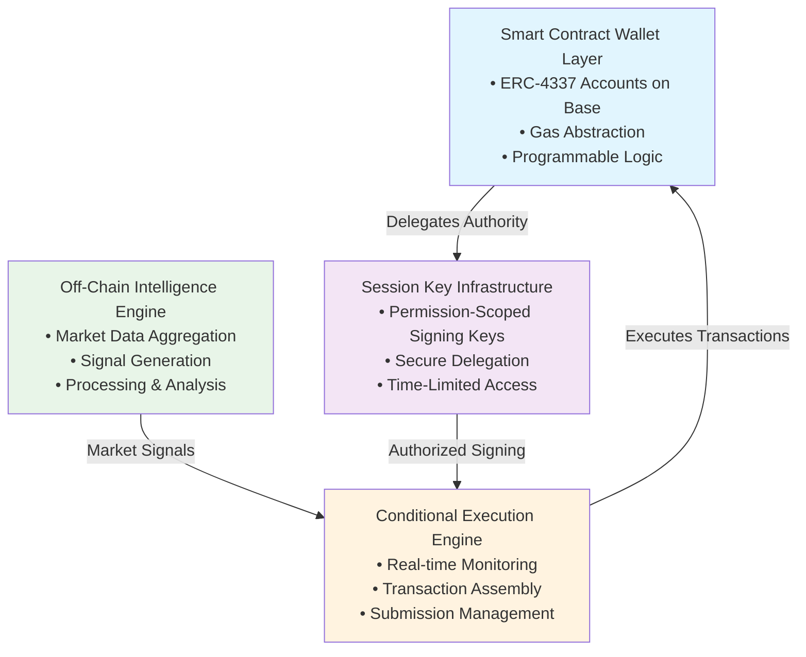
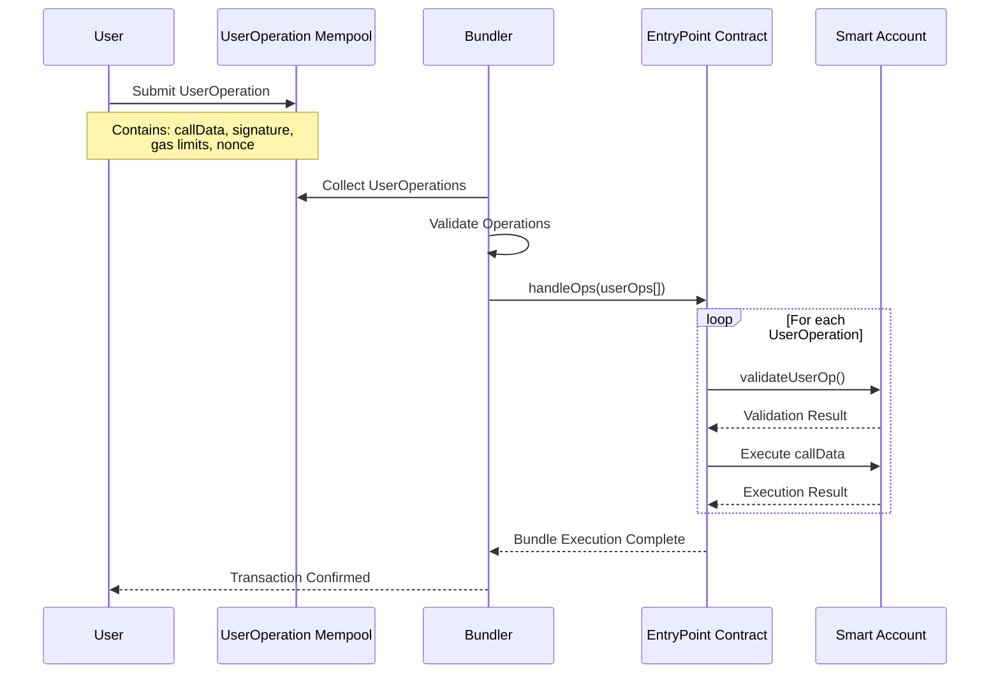
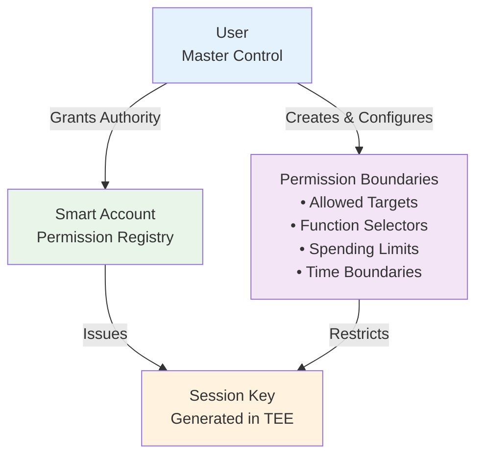
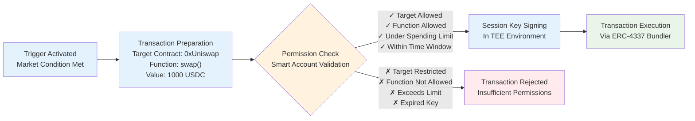
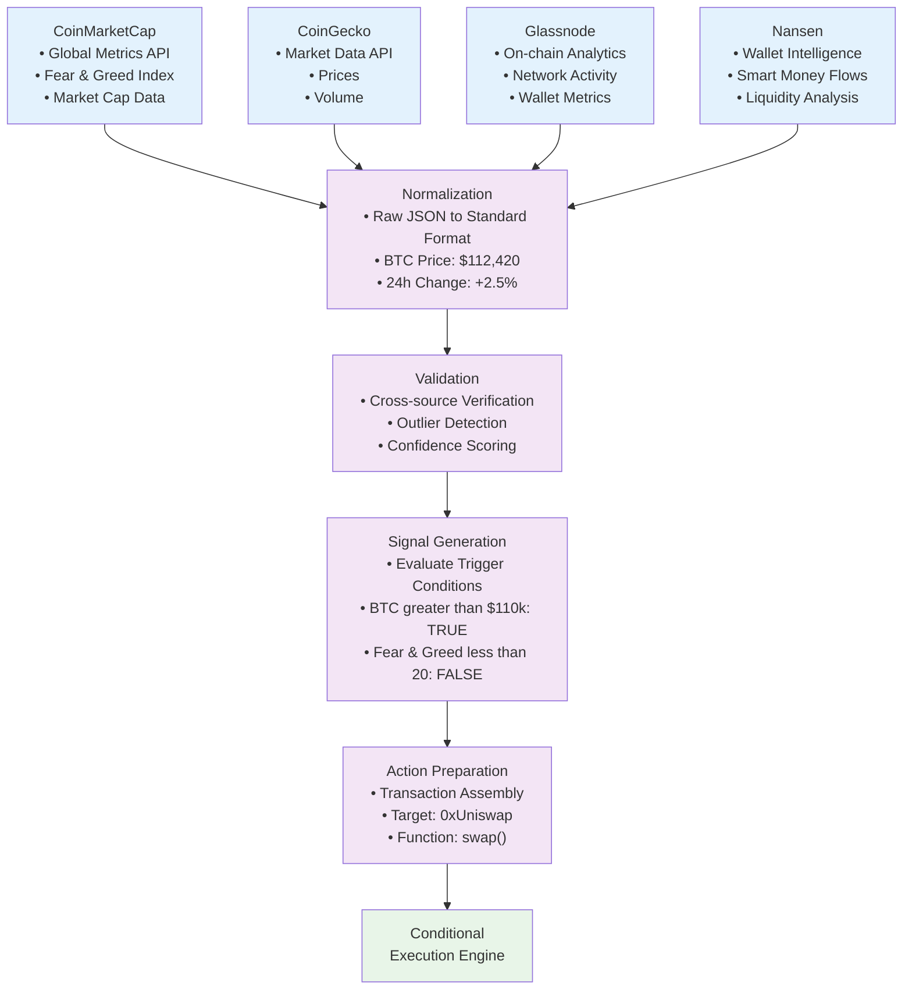
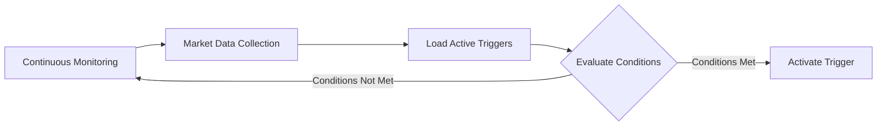
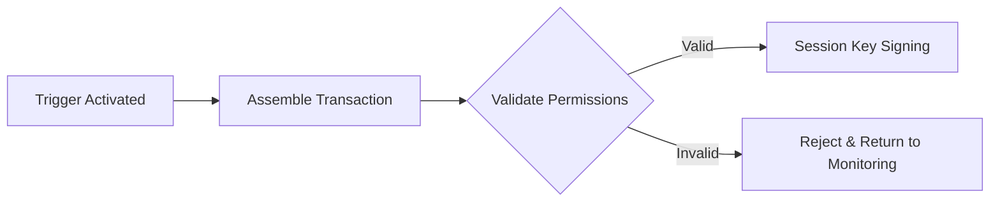
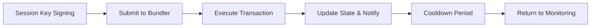

# MAFIA: Decentralized Crypto Automation Platform
## Technical Litepaper - Draft

**Version 1.0**  
**Date: September 2025**

---

## Abstract

MAFIA is an AI-enhanced crypto automation platform that leverages ERC-4337 account abstraction to enable gasless, conditional transaction execution based on intelligent market analysis. The system utilizes session keys for secure delegated signing, allowing server-side wallets to execute user-defined triggers without direct access to user funds. By integrating machine learning models with off-chain market data from multiple providers, the platform processes complex conditions such as Fear & Greed Index thresholds, market capitalization changes, and dominance ratios while providing AI-powered signal enhancement, natural language trigger creation, and context-aware execution optimization.

The platform's architecture combines the programmability of smart contract wallets with real-time market intelligence to create an autonomous execution layer for DeFi strategies, deployed initially on Base network for optimal performance and cost efficiency.

---

## 1. Introduction & Problem Statement

Cryptocurrency markets operate continuously across global timezones, requiring constant monitoring to capitalize on opportunities and manage risk. While market signals provide valuable insights for portfolio management, manual execution introduces emotional bias and timing delays that can significantly impact returns. Current decentralized finance (DeFi) automation solutions face several critical limitations:

**Manual Monitoring Overhead**: Users must continuously monitor market conditions to execute time-sensitive strategies, creating inefficiencies and missed opportunities due to human limitations and timezone constraints. 

**Gas Cost Friction**: Traditional automation requires users to maintain ETH balances for gas fees and execute transactions manually, creating barriers to adoption and strategy execution during high-congestion periods.

**User Experience Complexity**: Existing solutions require technical expertise to navigate multiple interfaces, manage private keys securely, and understand complex transaction flows.

**Conditional Logic Limitations**: Most platforms lack sophisticated conditional execution capabilities, limiting users to simple price alerts rather than complex multi-factor strategies.

**Intelligence Gap**: Existing automation tools operate on basic rule sets without contextual market understanding, missing opportunities for optimization and failing to adapt to changing market conditions.

MAFIA addresses these challenges by implementing a comprehensive AI-enhanced automation layer that combines account abstraction, delegated execution, machine learning intelligence, and real-time market analysis to create seamless, autonomous strategy execution with continuous optimization and contextual awareness.

---

## 2. System Architecture Overview

MAFIA's architecture consists of four primary components working in concert:

**Smart Contract Wallet Layer**: ERC-4337 compliant accounts deployed on Base network, providing gas abstraction and programmable transaction logic while maintaining user custody of funds.

**Session Key Infrastructure**: Temporary, permission-scoped signing keys that enable secure delegation of transaction execution to server-side systems without compromising user security.

**Off-Chain Intelligence Engine**: Data processing layer that aggregates market information from multiple sources, generates actionable signals, and evaluates user-defined trigger conditions in real-time.

**Conditional Execution Engine**: Real-time monitoring and execution system that processes triggers, prepares transactions, and submits them through ERC-4337 bundlers when conditions are met.



This modular architecture ensures separation of concerns while maintaining security boundaries between user funds, execution logic, and market data processing.

We will now cover each component in more detail.

---

## 3. ERC-4337 Account Abstraction Implementation

### Smart Contract Wallet Foundation

MAFIA utilizes ERC-4337 account abstraction to eliminate traditional wallet limitations and enable sophisticated automation features:

**UserOperation Flow**: Instead of traditional transactions, users submit UserOperations that contain execution instructions, gas payment information, and validation logic. These operations are processed by bundlers and executed atomically [^1].

#### Vertical Sequence Flow



**Gas Abstraction**: Smart accounts can pay gas fees in tokens other than the native network token, or have fees sponsored by third parties, eliminating the need for users to maintain ETH balances for automation.

**Programmable Validation**: Smart contract wallets can implement custom validation logic beyond simple signature verification, enabling features like spending limits, time-based restrictions, and multi-factor authentication.

### Base Network Benefits

Deployment on Base network provides several technical advantages:

**Low Transaction Costs**: Reduced gas fees enable cost-effective automation even for smaller portfolio sizes, making the platform accessible to a broader user base.

**Fast Finality**: Quick block times ensure trigger conditions can be evaluated and executed with minimal latency, crucial for time-sensitive market opportunities.

**EVM Compatibility**: Full Ethereum Virtual Machine compatibility allows seamless integration with existing DeFi protocols and tooling.


---

## 4. Session Key Infrastructure

### Delegated Signing Model

Session keys enable secure transaction delegation without exposing user private keys [^2]:

**Temporary Authorization**: Session keys are cryptographic keypairs with limited lifespans and restricted permissions, generated specifically for automation purposes.

**Permission Scoping**: Each session key operates within predefined boundaries, specifying which contracts can be called, what functions can be executed, and under what conditions.

**Revocation Mechanism**: Users maintain full control over session keys and can revoke permissions instantly, ensuring security in case of compromise.

### Implementation Architecture

The session key system operates through multiple layers:

**Key Generation**: Session keys are generated using cryptographically secure random number generation within Trusted Execution Environments (TEE) and stored in isolated server environments with hardware-level security measures. These keys are never exposed publicly and exist only within the secure enclave during generation and signing operations.

**Permission Definition**: Smart contracts validate session key permissions before execution, ensuring operations remain within user-defined boundaries:

```solidity
// Conceptual permission structure
struct SessionKeyPermission {
    address sessionKey;
    address[] allowedTargets;
    bytes4[] allowedSelectors;
    uint256 spendingLimit;
    uint256 validUntil;
}
```

#### Permission Setup Phase
Each session key must be explicitly set up by the user following this process:



#### Permission Validation Flow

**Execution Validation**: Before transaction execution, the smart account verifies that the session key has appropriate permissions for the requested operation.




### Security Boundaries

Session keys operate within strict security constraints:

**Scope Limitation**: Keys can only interact with pre-approved smart contracts and execute specific functions defined during setup.

**Value Restrictions**: Transaction value limits prevent unauthorized large transfers while allowing strategy execution.

**Time Boundaries**: All session keys have expiration times, temporally limiting exposure.

**Audit Trail**: All session key activities are recorded on-chain, providing transparent execution history.

---

## 5. Off-Chain Market Data Integration

 The off-chain data integration layer serves as the intelligence foundation for the platform, transforming raw market information into actionable signals for trigger evaluation.

### Adapter Pattern Architecture

MAFIA implements a flexible adapter system for integrating multiple data sources:

**Source Abstraction**: Each data provider is wrapped in a standardized adapter that normalizes data formats and provides consistent interfaces for downstream processing.

**Data Aggregation**: Multiple sources are queried simultaneously to ensure data reliability and reduce single-point-of-failure risks.

**Quality Assurance**: Data validation algorithms detect outliers, validate data consistency across sources, and assign confidence scores to different data points.

### Market Intelligence Processing

The platform processes various types of market data:

**Global Market Metrics**: Total market capitalization, 24-hour volume changes, and market-wide volatility indicators provide macro-economic context for trigger evaluation.

**Dominance Ratios**: Bitcoin and Ethereum dominance percentages offer insights into market sentiment and capital flow patterns.

**Sentiment Indicators**: Fear & Greed Index and similar sentiment metrics provide psychological market context for decision-making.

**Technical Indicators**: Moving averages, relative strength indicators, and custom composite metrics enable sophisticated technical analysis.

**AI-Enhanced Signal Processing**: Machine learning models analyze historical patterns and market correlations to classify signal strength, detect anomalies, and filter false positives. The AI layer continuously learns from trigger execution outcomes to improve signal quality and timing predictions.

### Data Processing Pipeline

Market data flows through a multi-stage processing pipeline:

1. **Collection**: Adapters query external APIs according to configured schedules
2. **Normalization**: Raw data is transformed into standardized formats
3. **Validation**: Data quality checks and cross-source verification
4. **Signal Generation**: Processed data is evaluated against trigger conditions
5. **Action Preparation**: Qualifying signals prepare transaction data for execution



---

## 6. Trigger System Architecture

### Condition Definition Framework

MAFIA's trigger system supports complex conditional logic:

**Simple Conditions**: Basic threshold comparisons (e.g., BTC price > $100,000).

**Composite Conditions**: Multiple conditions combined with logical operators (AND, OR, NOT).

**Time-Based Conditions**: Triggers that activate based on time windows or duration requirements.

**Relative Conditions**: Conditions based on percentage changes or moving averages

**Natural Language Processing**: AI-powered parsing engine converts user intent expressed in natural language ("alert me when BTC drops below $100k") into structured trigger conditions. The NLP layer validates logical consistency and suggests condition refinements based on market context.

### Condition Storage and Management

Triggers are stored off-chain within user smart accounts:

```solidity
// Conceptual trigger structure
struct Trigger {
    bytes32 id;
    address owner;
    Condition[] conditions;
    Action[] actions;
    bool active;
    uint256 lastExecuted;
    uint256 executionCount;
}

struct Condition {
    string dataSource;
    string metric;
    ComparisonOperator operator;
    uint256 threshold;
    uint256 timeWindow;
}
```

### Complete Trigger Examples

**Example 1: Market Fear Response Trigger**
```
IF (Fear & Greed Index < 20) AND (BTC Dominance > 50%)
THEN (Rebalance portfolio to 70% BTC, 30% stablecoins) AND (Send notification)

Conditions:
- Fear & Greed Index below 20 (extreme fear)
- Bitcoin dominance above 50% (flight to quality)
Actions:
- Automatically rebalance portfolio allocation
- Send multi-channel notification to user
```

**Example 2: Altcoin Season Detection Trigger**
```
IF (Total Market Cap > $3T) AND (BTC Dominance < 50%) AND (ETH Dominance 30-day change > +5%)
THEN Reallocate 40% holdings to DeFi basket

Conditions:
- Total crypto market cap exceeds $3 trillion
- Bitcoin dominance drops below 50%
- Ethereum dominance rises above 5% in the last 30 days
Actions:
- Shift allocation toward diversified DeFi positions
```

**Example 3: Market Top Signal Trigger**
```
IF (Fear & Greed Index > 90) AND (Total Market Cap 24h change > 10%) AND (Time since last execution > 7 days)
THEN (Take 50% profits to stablecoins) AND (Create alert for manual review)

Conditions:
- Extreme greed sentiment (Fear & Greed > 80)
- Rapid market expansion (>10% daily growth)
- Minimum 7-day cooldown period
Actions:
- Systematic profit-taking to reduce risk exposure
- Generate alert for additional manual strategy review
```

### Evaluation Logic

The trigger evaluation engine processes conditions systematically:

**Real-Time Processing**: Conditions are evaluated against incoming market data in real-time.
**State Tracking**: Trigger states are maintained to prevent duplicate executions and manage cooldown periods.
**Complex Logic**: Boolean algebra is applied to composite conditions to determine trigger activation.
**Priority Management**: Multiple active triggers are prioritized based on user preferences and urgency.

### Action Framework

Trigger activation results in predefined actions:

**Transaction Execution**: Automated trading, rebalancing, or position management.
**Notification Dispatch**: Multi-channel alerts via email, SMS, Telegram, or push notifications.
**Portfolio Adjustments**: Automatic allocation changes based on market conditions.
**Strategy Updates**: Dynamic modification of existing triggers based on market evolution.
**AI-Generated Analysis**: Context-aware AI assistant generates detailed market analysis reports when triggers activate, providing users with comprehensive explanations of market conditions, recommended follow-up actions, and strategic insights tailored to their portfolio composition and risk profile.

---

## 7. Conditional Execution Engine

### Server-Side Monitoring Architecture

The execution engine operates continuously to monitor trigger conditions:

**Event Loop Processing**: High-frequency polling of market data and trigger evaluation
**Queue Management**: Pending executions are queued and processed according to priority and timing requirements
**Resource Scaling**: Computational resources scale dynamically based on market activity and trigger volume

### Transaction Preparation and Execution

When trigger conditions are met, the system prepares and executes transactions:

**Transaction Assembly**: Based on trigger actions, transaction calldata is compiled from smart contract ABIs
**Session Key Signing**: Server-side wallets sign transactions using appropriate session keys
**Bundle Submission**: Signed transactions are submitted to ERC-4337 bundlers for inclusion in blocks
**Execution Monitoring**: Transaction status is tracked and reported back to users

#### Complete Trigger Evaluation and Execution Flow

**Phase 1: Monitoring and Condition Evaluation**


**Phase 2: Transaction Preparation and Validation**


**Phase 3: Execution and Completion**


### Error Handling and Recovery

Robust error handling ensures system reliability:

**Retry Logic**: Failed transactions are retried with exponential backoff to handle temporary network issues
**Fallback Mechanisms**: Alternative execution paths are attempted when primary methods fail
**User Notification**: Users are informed of execution failures with detailed error information
**State Recovery**: System state is maintained consistently even during failure scenarios

### Gas Optimization Strategies

Execution efficiency is optimized through several mechanisms:

**Batch Processing**: Multiple user operations are bundled together to reduce per-transaction costs
**Gas Price Management**: Dynamic gas pricing ensures timely execution while minimizing costs
**Transaction Simulation**: Transactions are simulated before execution to predict gas usage and prevent failures

---

## 8. Security Architecture

### Multi-Layer Security Model

MAFIA implements defense-in-depth security principles:

**Smart Contract Security**: Account contracts undergo extensive auditing and formal verification
**Key Management**: Session keys are generated, stored, and managed using industry-standard cryptographic practices
**Network Security**: All communications utilize TLS encryption and certificate pinning
**Operational Security**: Server infrastructure implements isolation, monitoring, and intrusion detection

### Session Key Security Boundaries

Session keys operate within carefully defined security perimeters:

**Permission Isolation**: Each session key can only perform specific, pre-authorized operations.
**Value Limitations**: Maximum transaction values prevent large unauthorized transfers.
**Contract Restrictions**: Session keys can only interact with whitelisted smart contracts.
**Temporal Boundaries**: All session keys have defined expiration times to limit exposure.

This ensures that in the event of a compromise, session keys are unable to create transactions not pre-approved by the user.

### Transaction Validation Pipeline

In addition to session key constraints, all transactions pass through multiple validation layers prior to execution:

**Permission Verification**: Smart contracts verify session key permissions.
**Business Logic Validation**: Transaction parameters are validated against user-defined rules.
**Security Checks**: Transactions are screened for suspicious patterns or anomalies.
**Rate Limiting**: Execution frequency is limited to prevent abuse.

### Attack Vector Mitigation

The system is designed to resist common attack patterns:

**Key Compromise**: Limited session key permissions minimize damage from individual key compromises
**Server Compromise**: Hardware-level isolation prevents access to sensitive cryptographic material
**Smart Contract Exploits**: Modular architecture limits blast radius of potential contract vulnerabilities
**Social Engineering**: Multi-factor authentication and confirmation mechanisms prevent unauthorized changes
**AI-Powered Anomaly Detection**: Machine learning models continuously monitor user behavior patterns, transaction sequences, and system interactions to detect suspicious activities. The AI security layer identifies deviations from established user patterns, unusual trigger modifications, and potential compromise indicators, triggering automated security protocols and user notifications.

---

## 9. Token Economics & Governance Structure

### Token Utility Framework

MAFIA incorporates the $MAFIA token as a core component for platform enhancement, governance, and community incentives:

**Premium Feature Access**: Users pay with $MAFIA tokens to unlock advanced platform features and capabilities beyond the base automation functionality.

**Gamification Integration**: The platform implements a mafia-themed hierarchy system where users earn Respect Points (RP) based on platform engagement, referrals, and successful automation strategies. User ranks (Associate to Soldier to Caporegime to Consigliere to Underboss to Boss) serve as multipliers for RP accumulation.

**Epoch-Based Rewards**: The platform operates on epoch cycles where users earn RP throughout each period. At epoch conclusion, the total reward pool is distributed proportionally based on individual RP earned relative to the total RP accumulated across all users.

### Vote-Escrowed MAFIA (veMAFIA)

**Locking Mechanism**: Users lock $MAFIA tokens to create veMAFIA, representing voting power within the protocol. This system draws inspiration from Curve Finance's proven ve-token model for time-weighted governance participation.

**Governance Architecture**: veMAFIA holders participate in protocol governance, voting on system parameters, data source integrations, fee structures, and platform development priorities.

### Technical Implementation

**Smart Contract Integration**: Governance smart contracts interface with the core automation infrastructure through well-defined boundaries, ensuring governance decisions can influence platform direction without compromising execution reliability.

**Decentralized Evolution**: The architecture supports transition from centralized execution toward community-governed protocol decisions while maintaining technical infrastructure integrity and automation performance.

---

## 10. Scalability & Performance Considerations

### Current Architecture Limitations

The initial implementation has several scalability constraints:

**Server Dependency**: Current architecture relies on centralized servers for trigger evaluation and execution
**Network Congestion**: High Base network activity can delay transaction execution
**Data Source Limitations**: API rate limits restrict the frequency of market data updates

### Performance Optimization Techniques

Several strategies optimize system performance:

**Efficient Data Structures**: Optimized algorithms for trigger evaluation and data processing
**Caching Strategies**: Frequently accessed data is cached to reduce API calls and improve response times
**Parallel Processing**: Multiple triggers and data sources are processed concurrently
**Database Optimization**: Indexed data structures enable fast querying of historical data and trigger states

### Future Scalability Improvements

Planned enhancements will address current limitations:

**Decentralized Keeper Networks**: Migration to decentralized execution networks could eliminate server dependency
**Layer 2 Integration**: Support for multiple Layer 2 networks could reduce costs and increase throughput
**Advanced Caching**: More sophisticated caching mechanisms could reduce external API dependencies
**Horizontal Scaling**: Microservices architecture could enable better resource allocation and fault isolation

### Multi-Chain Expansion Patterns

The architecture is designed for eventual multi-chain deployment:

**Chain Abstraction**: Trigger logic remains consistent across different blockchain networks
**Cross-Chain Communication**: Standardized interfaces enable trigger execution across multiple chains
**Unified User Experience**: Users can manage triggers across multiple networks from a single interface
**Network-Specific Optimizations**: Execution strategies are optimized for each network's characteristics

---

## 11. Conclusion

MAFIA represents a significant advancement in DeFi automation by combining ERC-4337 account abstraction with AI-enhanced market intelligence and secure delegated execution. The platform's architecture addresses key limitations in current automation solutions while introducing machine learning capabilities that continuously adapt and optimize user strategies, all while maintaining security and decentralization principles.

### Technical Innovation Summary

The integration of session keys with smart contract wallets, enhanced by AI-powered decision-making, creates a new paradigm for intelligent automation that eliminates traditional friction points while preserving user control. The AI-enhanced data processing pipeline continuously learns from market patterns and execution outcomes, while natural language processing enables intuitive strategy creation. The machine learning-optimized execution engine provides reliable conditional transaction processing with adaptive timing and risk assessment.

### Implementation Benefits

Users benefit from reduced manual overhead, eliminated gas management complexity, and access to AI-enhanced automation strategies previously available only to institutional actors. The platform democratizes intelligent DeFi strategies through natural language interfaces and context-aware optimization while maintaining security standards appropriate for managing significant capital.

### Future Development Directions

The modular architecture provides a foundation for continuous evolution. Planned enhancements include expanded data source integration, more sophisticated AI models for predictive analysis, advanced natural language processing capabilities, cross-chain execution with intelligent routing, and migration to fully decentralized execution networks with distributed AI inference. These improvements will further reduce centralization while expanding the platform's intelligent automation capabilities.

MAFIA's technical architecture demonstrates how thoughtful integration of emerging Web3 standards with artificial intelligence can solve real-world user problems while maintaining the security and decentralization principles that make blockchain technology valuable. The platform provides a blueprint for future AI-enhanced DeFi automation systems that prioritize intelligent functionality, user sovereignty, and adaptive optimization.

---

## References

[^1]: ERC-4337: Account Abstraction Using Alt Mempool. Ethereum Improvement Proposals. https://eips.ethereum.org/EIPS/eip-4337

[^2]: Session Keys and Delegation. ERC-4337 Documentation. https://docs.erc4337.io/smart-accounts/session-keys-and-delegation

---

*This litepaper describes the technical architecture of MAFIA v2.0 as implemented in 2025. Technical specifications may evolve as the platform develops and integrates new technologies.*